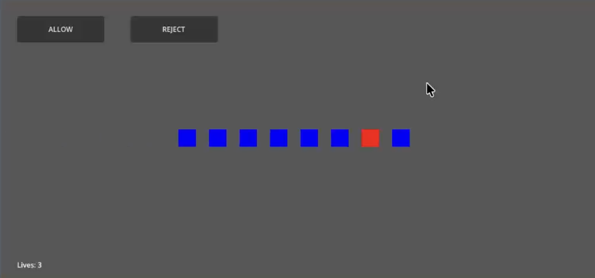

# Bouncer Bot

## 🎮 Project Overview

**Bouncer Bot** is a queue-based decision game built using **Godot 4**.

The player acts as a bouncer/security officer and must **ALLOW** or **REJECT** incoming characters while managing queue pressure, limited lives, and increasing difficulty.

  

The project follows an **iterative prototype-first approach**, focusing on gameplay mechanics before visuals, sound, and polish.

  

---

  

## 🧪 v0.1.0 — Core Gameplay Alpha (Week 1)

  

### ✅ Implemented

- Allow / Reject decision system

- Automatic character spawning

- Queue system:

- Characters enter from the left

- Characters line up visually

- Smooth queue animation

- Lives system:

- Incorrect decisions reduce lives

- Game over at zero lives

- Level system:

- 25 characters per level

- Levels increase difficulty

- Difficulty scaling:

- Spawn speed increases per level

- Lose conditions:

- Game over when lives reach zero

- Instant loss if queue exceeds 10 characters

- Game over state:

- Buttons disabled

- Spawning stops

  

### 🎮 Gameplay Notes

- Player judges only the front character in the queue

- Characters are removed after each decision

- Gameplay pressure increases naturally through speed and queue size

  

### 🎨 Visuals

- Placeholder rectangles used for characters

- Visual simplicity used intentionally to validate mechanics

  

**Goal of Week 1:**

Validate the complete gameplay loop and progression system.

  

---

  

## 🎞️ Gameplay Demo

A test video of the current alpha build can be viewed here:

https://youtu.be/HKaZn1ZmM-8

  

---

  

## Screenshots

  

  

## 🧭 v0.2.0 — Planning & Pre-Production (Week 2)

  

### 📝 Planned Tasks

- Finalise design direction for characters

- Plan character traits and rule expansion

- Plan visual style and map theme

- Plan sound design (SFX and background audio)

- Refine scope for beta development

- Prepare asset pipeline and folder structure

  

### 🎯 Focus

- No new features implemented

- Design decisions documented

- Scope locked for upcoming beta phase

  

**Goal of Week 2:**

Prepare a clear and realistic plan for expanding the game without increasing technical risk.

  

---

  

## 🧪 v0.3.0 — Beta Expansion (Week 3)

  

### 🔜 Planned Features

- Replace placeholder rectangles with character sprites

- Add visual character traits (e.g. hats, accessories)

- Add a static background map/environment

- Add sound effects:

- Button clicks

- Correct / wrong decision feedback

- Improve UI layout and visual clarity

  

---

  

## 🎨 v1.0.0 — Final Polish (Week 4)

  

### 🔜 Planned Features

- Character animations

- Level transition feedback

- Background music

- Restart and menu system

- Scoring and combo mechanics

- Final balancing and bug fixing

  

---

  

## 📌 Development Philosophy

-  **Week 1:** Core mechanics & progression

-  **Week 2:** Planning & scope definition

-  **Week 3:** Visuals, characters, sound (Beta)

-  **Week 4:** Polish & final presentation

  

---

  

## 👤 Credits

Developed by: **Sothea Seng**

Engine: **Godot 4**

Maps: https://sirnosir.itch.io/pixelwhale-sf

Character: https://level-launch16.itch.io/tiny-people-1

Sound: https://bit-by-bit-sound.itch.io/16-bit-starter-pack

  

---

  

## AI Usage

  

### ChatGPT:

"What does alpha version of a game usually contain?
"How do I write a good README file that is easily understandable"
  

## 📝 Versioning

This project uses semantic versioning:

-  `0.x.x` → Prototype / Alpha

-  `1.0.0` → Final release